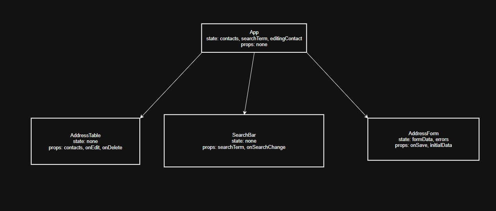

## Патерни

**Підняття стану (Lifting State Up):**
Весь стан (`contacts`) зберігається в `App` і передається в таблицю через `props`.

**Умовна візуалізація (Conditional Rendering):**
Таблиця показує "No data to display", якщо масив `contacts` порожній, інакше відображає дані.

**Візуалізація списків (Rendering Lists):**
Використовується метод `.map()` для динамічного створення рядків таблиці з масиву `contacts`, з обов’язковим атрибутом `key`.

# REACT_KR1
